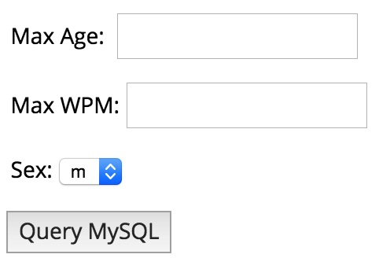

# AJAX 之数据库操作

为了说明使用 AJAX 从数据库中访问信息有多么容易，我们要构建一个 MySQL 查询，然后把结果显示在 "ajax.html" 中。但是在开始之前，我们先来做一些基础工作。使用下面的命令创建一个数据表。

__注意：__ 这里我们假设你有足够的权限执行以下 MySQL 操作。

```
CREATE TABLE 'ajax_example' (
   'name' varchar(50) NOT NULL,
   'age' int(11) NOT NULL,
   'sex' varchar(1) NOT NULL,
   'wpm' int(11) NOT NULL,
   PRIMARY KEY  ('name')
)
```

然后使用下面的 SQL 语句把下列数据存到这个表中：

```
INSERT INTO 'ajax_example' VALUES ('Jerry', 120, 'm', 20);
INSERT INTO 'ajax_example' VALUES ('Regis', 75, 'm', 44);
INSERT INTO 'ajax_example' VALUES ('Frank', 45, 'm', 87);
INSERT INTO 'ajax_example' VALUES ('Jill', 22, 'f', 72);
INSERT INTO 'ajax_example' VALUES ('Tracy', 27, 'f', 0);
INSERT INTO 'ajax_example' VALUES ('Julie', 35, 'f', 90);
```

## 客户端 HTML 文件

现在我们来建立客户端的 HTML 文件，也就是 ajax.html，它的代码如下所示：

```
<html>
<body>
<script language="javascript" type="text/javascript">
<!-- 
// 浏览器支持代码
function ajaxFunction(){
	var ajaxRequest;  // 缓存 XMLHttpRequest 对象
	try{

		// Opera 8.0+, Firefox, Safari
		ajaxRequest = new XMLHttpRequest();
	}catch (e){
	  
		// Internet Explorer Browsers
		try{
			ajaxRequest = new ActiveXObject("Msxml2.XMLHTTP");
		}catch (e) {

			try{
				ajaxRequest = new ActiveXObject("Microsoft.XMLHTTP");
			}catch (e){

				// 错误处理
				alert("Your browser broke!");
				return false;
			}
		}
	}

	// 创建一个接受服务器发送的数据的函数，它还会更新同一页面的 div 部分。
	ajaxRequest.onreadystatechange = function(){

		if(ajaxRequest.readyState == 4){
			var ajaxDisplay = document.getElementById('ajaxDiv');
			ajaxDisplay.innerHTML = ajaxRequest.responseText;
		}
	}

	// 然后获取用户输入值并传递给服务器脚本
	var age = document.getElementById('age').value;
	var wpm = document.getElementById('wpm').value;
	var sex = document.getElementById('sex').value;
	var queryString = "?age=" + age ;

	queryString +=  "&wpm=" + wpm + "&sex=" + sex;
	ajaxRequest.open("GET", "ajax-example.php" + queryString, true);
	ajaxRequest.send(null); 
}
//-->
</script>

<form name='myForm'>

	Max Age: <input type='text' id='age' /> <br />
	Max WPM: <input type='text' id='wpm' /> <br />
	Sex: 
	<select id='sex'>
	  <option value="m">m</option>
	  <option value="f">f</option>
	</select>
	<input type='button' onclick='ajaxFunction()' value='Query MySQL'/>
   
</form>
<div id='ajaxDiv'>结果会显示在这里。</div>
</body>
</html>
```

__注意：__ 在查询中传递变量的方法取决于 HTML 标准以及我们使用哪种形式。

```
URL?variable1=value1;&variable2=value2;
```

上面的代码显示如下所示：

__注意：__ 这还是一个模拟的屏幕显示，它还不能工作。



获取到条目之后结果会显示在表单的下面。

__注意：__ 这里是一个模拟的屏幕显示。

## 服务端 PHP 文件

客户端脚本已经准备就绪。现在，我们来编写服务端脚本，它会从数据库中提取 age，wpm 和 sex，然后把它们发送回客户端。请把下面的代码放到 "ajax-example.php" 中。

```
<?php
$dbhost = "localhost";
$dbuser = "dbusername";
$dbpass = "dbpassword";
$dbname = "dbname";
	
// 连接 MySQL 服务器
mysql_connect($dbhost, $dbuser, $dbpass);
	
// 选择数据库
mysql_select_db($dbname) or die(mysql_error());
	
// 从查询字符串中检索数据（字段）
$age = $_GET['age'];
$sex = $_GET['sex'];
$wpm = $_GET['wpm'];
	
// 转移用户输入便于防止 SQL 注入
$age = mysql_real_escape_string($age);
$sex = mysql_real_escape_string($sex);
$wpm = mysql_real_escape_string($wpm);
	
// 构建查询
$query = "SELECT * FROM ajax_example WHERE sex = '$sex'";

if(is_numeric($age))
	$query .= " AND age <= $age";

if(is_numeric($wpm))
	$query .= " AND wpm <= $wpm";
	
// 执行查询
$qry_result = mysql_query($query) or die(mysql_error());

// 构建结果字符串
$display_string = "<table>";
$display_string .= "<tr>";
$display_string .= "<th>Name</th>";
$display_string .= "<th>Age</th>";
$display_string .= "<th>Sex</th>";
$display_string .= "<th>WPM</th>";
$display_string .= "</tr>";

// 针对返回的每个 person 条目在表格中插入一个新行
while($row = mysql_fetch_array($qry_result)){
	$display_string .= "<tr>";
	$display_string .= "<td>$row[name]</td>";
	$display_string .= "<td>$row[age]</td>";
	$display_string .= "<td>$row[sex]</td>";
	$display_string .= "<td>$row[wpm]</td>";
	$display_string .= "</tr>";
}

echo "Query: " . $query . "<br />";
$display_string .= "</table>";

echo $display_string;
?>
```

现在可以尝试在 _Max Age_ 或者其他输入框中输入一个有效的值（比如 120），然后点击 Query MySQL 按钮。


<p style="color: red">获取到条目之后结果将会显示在这个部分</p>

如果你成功完成这一课，那么你就知道如何串联使用 MySQL，PHP，HTML 和 JavaScript 编写 AJAX 应用程序了。