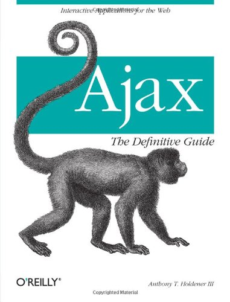
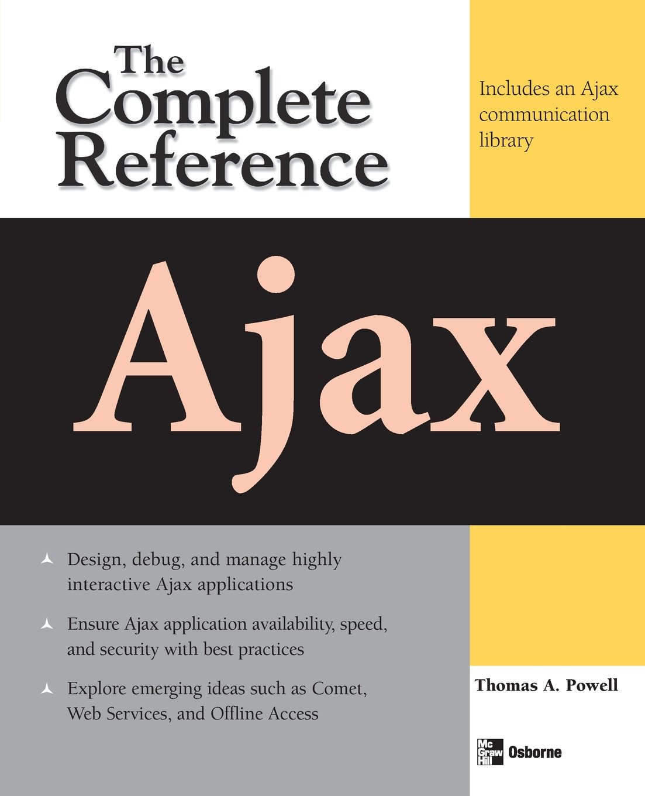
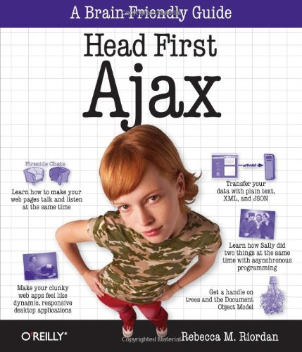
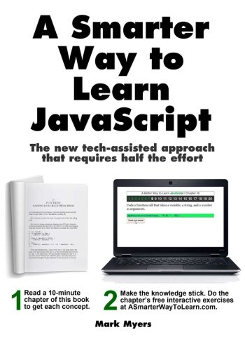
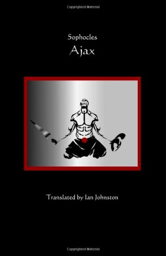

# 有用的 AJAX 资源

以下资源包含了额外的 AJAX 相关的信息。请使用它们来获取关于这一主题更深入的知识。

## 有用的链接

- [AJAX Wifi](http://en.wikipedia.org/wiki/Ajax_(programming)) - 维基百科上的 AJAX 参考。

- [AJAX 介绍](http://api.prototypejs.org/ajax/) - AJAX 教程。

- [AJAX](http://teamtreehouse.com/library/ajax-basics) - AJAX 基础教程。

## 有用的书籍

要在本页添加你的站点，请发送电子邮件至 __contact@tutorialspoint.com__。